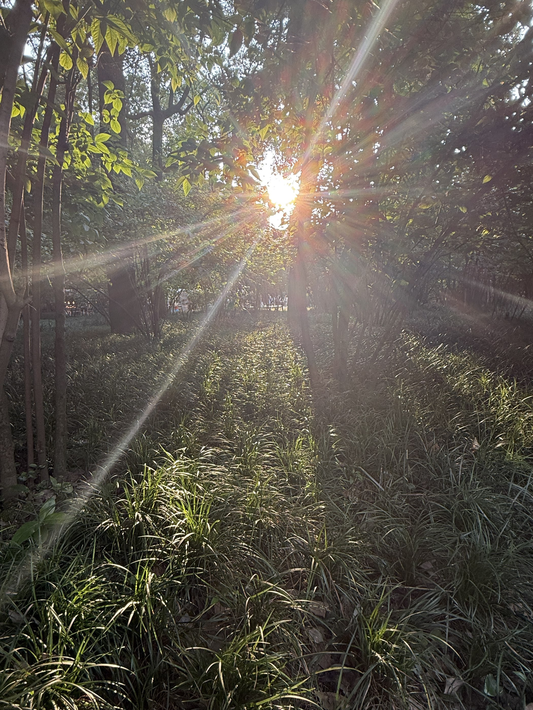

<html lang="en">
<head>
    <meta charset="UTF-8">
    <meta name="viewport" content="width=device-width, initial-scale=1.0">
    <title>我的简介</title>
</head>
<body>
    <h1>我的简介</h1>
    
师兄（师姐）好，我是来自大一的蔡洽铖，作为一名新手小白，希望能在微光开启一段愉快的旅程

    
我做这道题的感受时学到了很多前端的东西，比如说HTML格式，如何插入图片，音频文字信息，能够在网页中打开，看到属于自己的网页感觉很有成就感
    

    <h2>一些喜欢的图片和网站</h2>
    </img>
    </img>
    </img>
     
    <a href="https://www.bilibili.com/">哔哩哔哩</a>
    <a href="https://china.nba.cn/index">nba</a>
</body>
</html>
